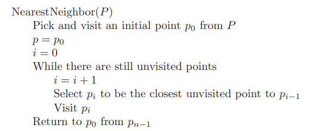

# Practical Algorithm Design

## Chapter 1 - Introduction to Algorithm Design

[Insert Sort](algorithms/insert_sort.py)

 Algorithms should be  _correct_ and _efficient_, while still being easy to _implement_.

 ### 1.1 Robot Tour Optimization

 If we have to look for the shortest path that connects all points 

- **Problem**: Robot Tour Optimization
- **Input**: A set S of n points in the plane.
- **Output**: What is the shortest cycle tour that visits each point in the set S?

 

 The first solution we can think is to simply pick a point ( in our case 0) and look for the nearest point, repeating the process

However this gives a very bad answer when considering negative points

 

